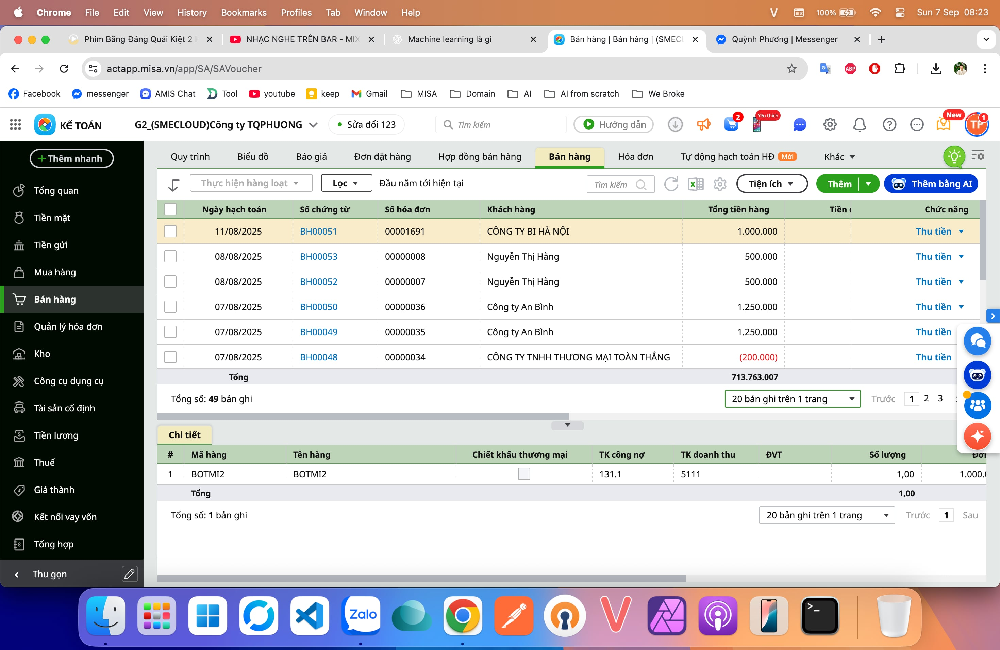
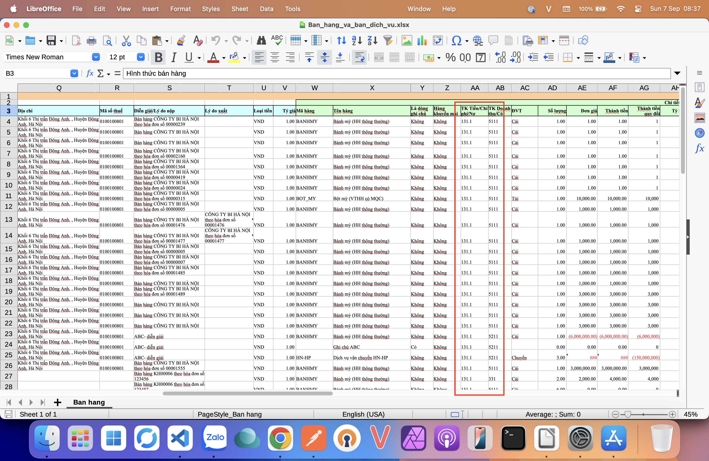
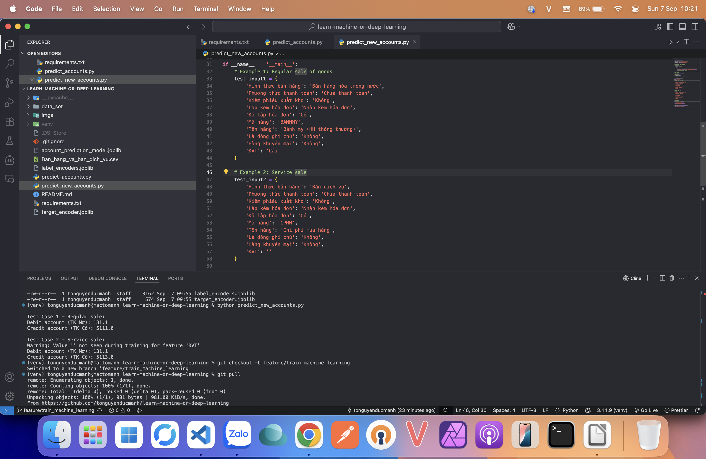

# Project test việc training model bằng machine_learning và deep_learning

Project này sẽ tập trung vào việc kiểm thử xem AI có gợi ý được tài khoản nợ và tài khoản có của kế toán không

Data set được sử dụng trong project này đã được xuất ra từ dữ liệu dưới đây
(Data set này được trích xuất bằng tính năng tải dữ liệu cho người dùng hết hạn, khi đó master-detail chứng từ sẽ được xuất đầy đủ và trải phẳng ra 1 file excel)



Các cột cần huấn luyện model tập trung chủ yếu vào việc dự đoán được các giá trị sau



Demo việc gợi ý tài khoản chứng từ bán hàng theo các thông tin của chứng từ này



Để chạy project, thực hiện các command sau

```
python -m venv venv
```

active venv trên window

```
venv\Scripts\activate
```

active venv trên macos/linux

```
source venv/bin/activate
```

install package

```
pip install -r requirements.txt
```


để train model, chạy file 

```
python predict_accounts.py
```

để gợi ý, chạy file

```
python predict_new_accounts.py
```
